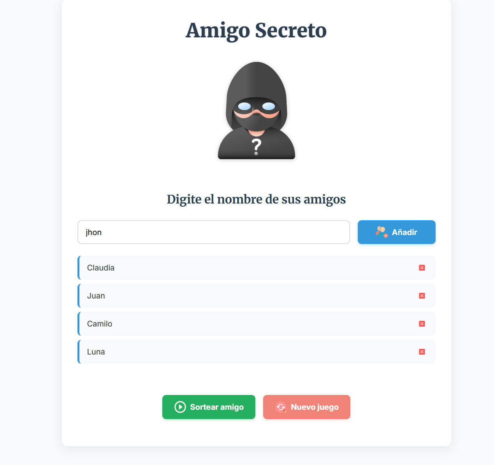
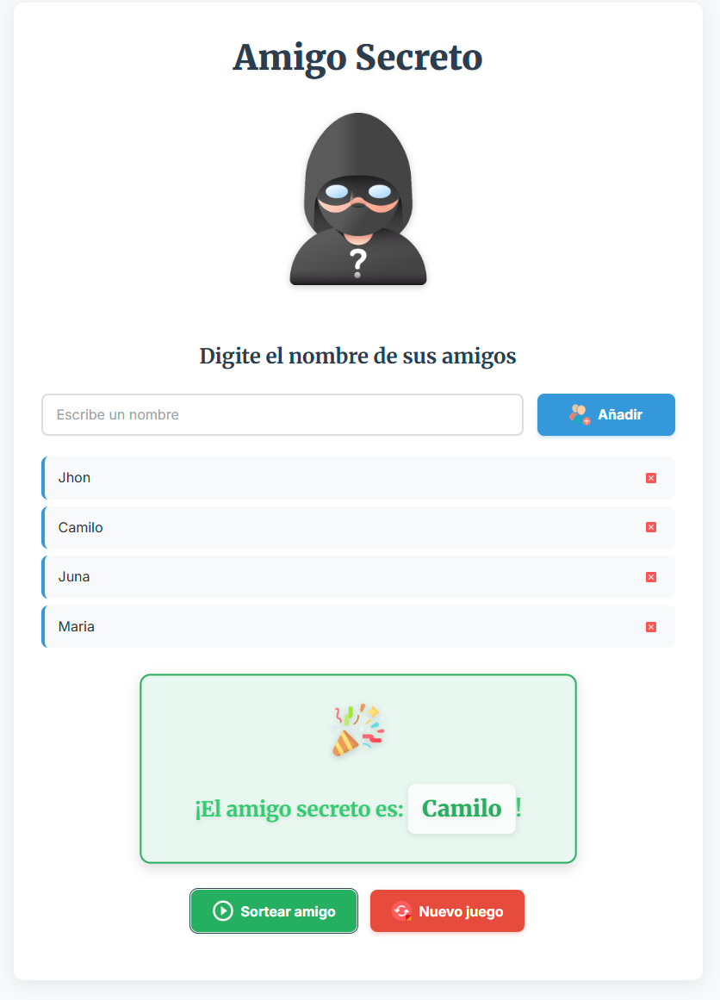
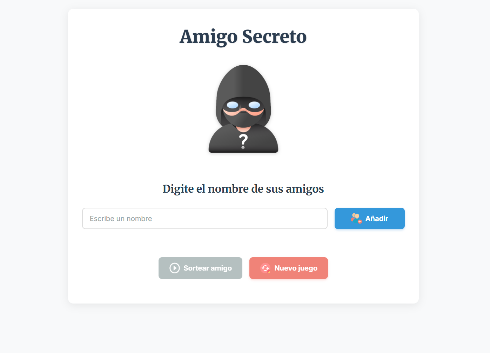

# Amigo Secreto 🎉

Aplicación web para organizar sorteos de "Amigo Secreto" de forma sencilla y segura.

## Funcionalidades

- **Agregar amigos:** Ingresa nombres y añádelos a la lista con el botón o la tecla enter. Se valida que el nombre sea correcto, no tenga caracteres extraños o el campo este vacio y no esté repetido.
- **Eliminar amigos:** Puedes quitar cualquier amigo de la lista antes del sorteo.
- **Sortear amigo secreto:** Elige aleatoriamente un amigo de la lista y muestra el resultado en pantalla.
- **Reiniciar juego:** Borra la lista y el resultado para comenzar un nuevo sorteo.
- **Validación y seguridad:** Los nombres se validan y escapan para evitar errores y vulnerabilidades XSS.
- **Interfaz amigable:** Botones y campos se habilitan/deshabilitan según el estado del juego.

## Uso

1. Escribe el nombre de un amigo y presiona "Enter" o haz clic en "Agregar".
2. Repite el proceso para todos los participantes.
3. Haz clic en "Sortear" para elegir al amigo secreto.
4. Si lo deseas, reinicia el juego para empezar de nuevo.






## Estructura del proyecto

```
challenge-amigo-secreto/
├── app.js          # Lógica principal de la aplicación
├── index.html      # Interfaz de usuario
├── style.css       # Estilos visuales
├── assets/         # Imágenes y recursos gráficos
```

## Requisitos

- Navegador web moderno (Chrome, Firefox, Edge, etc.)
- No requiere instalación ni dependencias externas.

## Cómo ejecutar

1. Descarga o clona el repositorio.
2. Abre `index.html` en tu navegador con liveserver o el servidor que prefieras.

## Autor

Desarrollado por Hugo I. Rodríguez.

---

¡Disfruta tu sorteo de los amigos secretos
